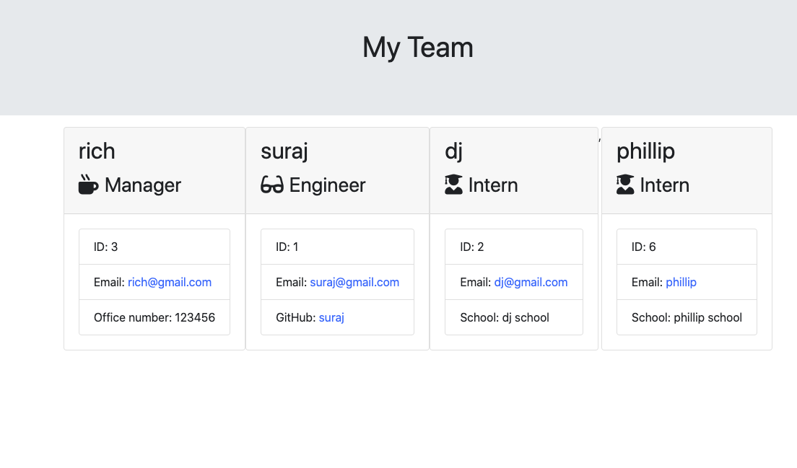

# Profile Team Generator
* User(manager,engineers and intern) is prompt to build an engineering team, which consist of a manager, and any nuber of engineers and interns.
* On the basis of user input in Prompt, it will generate a `team.html` page in the `Output` directory,that displays a nicely formatted team roster.Each team member should display the following in no particular order:

  * Name

  * Role

  * ID

  * Role-specific property (School, link to GitHub profile, or office number)

## Demostration of Profile Team Generator

